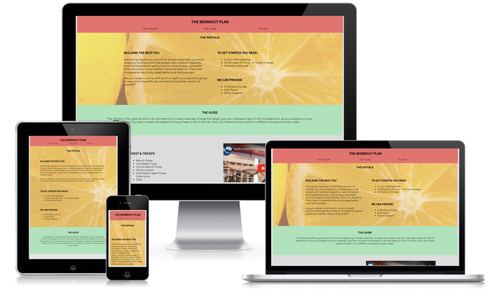
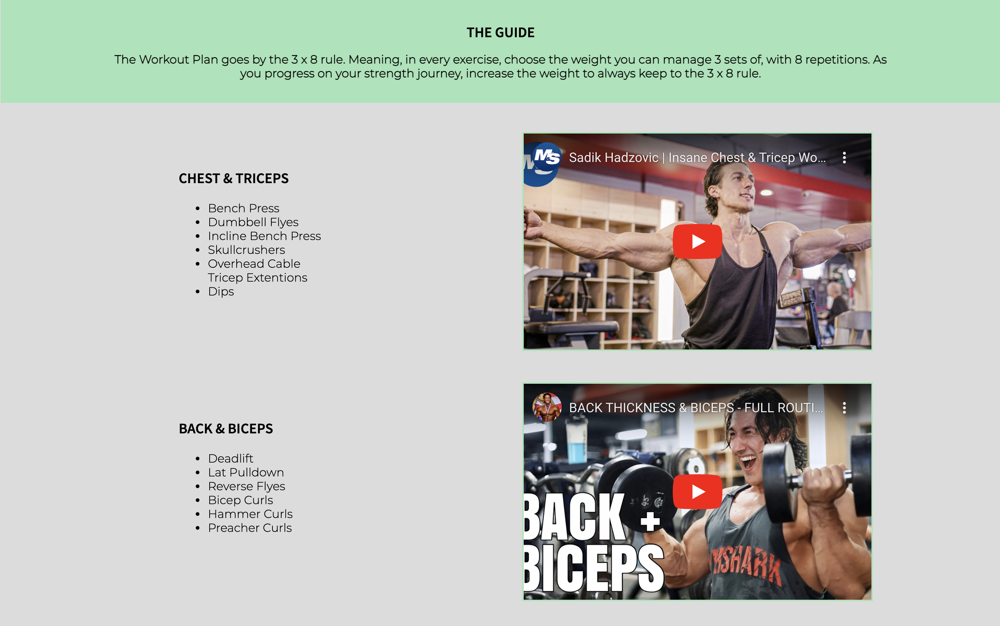
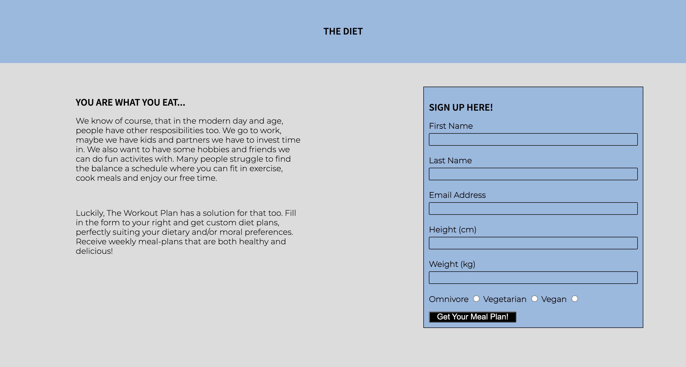

# The Workout Plan

- **The Workout Plan** is a web-page which aims to inspire and help people achieve a healthier lifestyle through exercise and diet. The specific workout-regimen is one that I have developed myself, therefore the exercises are 'male coded' and the target audience is males that exercise at the gym. However, there are no restrictions or reasons why other genders wouldn't find the site useful.
- Another aim of the site was to neutralize the intimidation one can feel when visiting gym-platforms or lifestyle forums where you are made to feel inferior by images of workout-experts, or getting products shoved in your face. 
  - The website achieves this through words of encouragement, dull color-pallettes and the helpful and inclusive service through the meal-plan. 
- The web-site consists of 3 sections - The Peptalk, The Guide and The Diet. 
- Users of this website will hopefully be inspired, receive instructions on how to carry out their exercise-regimen, and lastly receive a meal-plan that will help them achieve greater health. 

 

## Features
---
### Navigation

- The top of the page has a navigation menu. The main header links to the top of the page.
- It has three menu-items - The Peptalk, The Guide and The Diet. These are anchor-links and will send you to the appropriate section. 
- The menu is a dull orange color which gives great contrast to the black text-color and fits in with the other soft dull color-pallettes spaning the whole page. 
- The menu is very simplistic and intuitive to use. 

 

### The Header

- The header page - The Peptalk, gives the user information about the importance of exercising and the other health benefits that it gives.
- The section provides the user with the criterias for being able to get the most out of the The Workout Plan, and what we can offer. 

 

### The Guide Section

- Working out is a very broad topic and there are many ways to execute it. This section gives the user a work-out routine, split into a set amount of sessions.
- The user gets to know how many times a week, what exercises to do, how to approach them, and there is a relevant video embedded for every split (muscle-group). 

 

### The Diet Section 

- The Diet-page gives some moral-support regarding the stressful environments we live in today and how making time for things can be difficult. 
- We offer a solution, where we can help you out with a custom meal-plan suiting your body-type and lifestyle/morals. 
- There is a signup form, where you get to fill in the relevant information.
- The form collects first and last name, e-mail adress, your height and weight and if you are an omnivore, vegetarian or vegan. 
- This form is optional, but will help you greatly towards reaching your fitness-goals. 

 

### Social Media Footer

- The footer has links to facebook, instagram, twitter and youtube. Which gives the user the possibility to reach out to our social media channels.

 

## Testing
---
- I tested that this page works in different browsers like Chrome, Safari and Firefox. 
- Tested that all the links in the navigation menu and in the footer work correctly.
- Confirmed that this site is responsive and works on all different screensizes ranging from 320 pixels to 1200 pixels and above.
- Confirmed that text is readable and videos and links are intuitive to use. 
- Confirmed that the form works, all fields are required and users have to enter the correct information, and within the set-up minimum and maximum spans before it can be submitted.

## Bugs
---
### Solved Bugs

- Upon reading and receiving recommendation to use CSS Grid I had some issues aligning and getting good width on content. 
  - I solved this by figuring out that you could add empty divs and use them as columns to align text and images better. 

- Had issues with making the videos scale correctly for a responsive layout in CSS Grid.
  - I contacted Student Support and was recommended to read and learn about Flex Box.
  - I then used Flex Box for the entire Guide-section and received good results. 

- Had some difficulty with the properties justify-content and align-content when wanting to adjust the Guide section for different media queries. 
  - Both times it was solved by changing the width of the related elements.

- I struggled with creating a sticky header for my navigation menu.
  - Fixed with the `position:fixed;` property.

- Wanted to add a background-image last minute and had major problems with getting the right crop of the image.
  - Solved through learning about the background-position property.

## Validator Testing
---
### HTML

- No errors when testing with official W3C HTML Validator.

### CSS
- No errors when testing with official W3C (Jigsaw) CSS Validator.

### Accessibility
- Confirmed that fonts and colors are readable and site is accessisble through Lighthouse in DevTools. 

 

### Unfixed Bugs

- Due to the height of the sticky menu, the links in the navbar are actually linked a few rows above the section. 
  - This also means that when you click The Peptalk in the sticky-menu, you wont be able to see the header unless you scroll. 
  - This could have been solved by giving the Peptalk section-header more height, but I felt like there would be too many colors, and too much space between. 

- To make the logo be on it's own row using CSS Grid, I gave the block a width of 100%. Visually this has no implications, however you are able to click the "invisible" index.html link to the right and left of it. 

## Deployment

- The Site was deployed to the GitHub pages. The steps to deploy are as follows:
  - In the GitHub repository navigate yourself to the Settings tab.
  - From the source section drop-down menu, select the Main branch. 
  - Once the main branch has been selected, the page provided the link to the completed website. 
  
- The live link could be found here: [The Workout Plan](https://j-a-s-m-i-n-j.github.io/the-workout-plan/).

## Credits
---
### Content

- For the footer I was inspired by the code that we used for the [Love Running](https://github.com/J-A-S-M-I-N-J/Love-Running-Walkthrough-Jasmin) project.

- The Form from [Love Running](https://github.com/J-A-S-M-I-N-J/Love-Running-Walkthrough-Jasmin) was used as a base and later edited. 

### Guides & Troubleshooting

### CSS Grid
- [W3Schools](https://www.w3schools.com/css/css_rwd_grid.asp) 

### Flexbox

- [Youtube](https://www.youtube.com/watch?v=9e-lWQdO-DA) 
- [CSS-Tricks](https://css-tricks.com/snippets/css/a-guide-to-flexbox/) 
- [W3Schools](https://www.w3schools.com/css/css3_flexbox_container.asp) 

### Sticky Header

- [Stack Overflow](https://stackoverflow.com/questions/55739582/how-to-create-a-fixed-sticky-header-on-scroll-with-html-and-css-only)
- [Codepen](https://codepen.io/phajek/pen/BbeqLG)
- [CSS Deck](https://cssdeck.com/blog/how-to-make-a-sticky-header-step-by-step/) 

### Media Queries  

- [W3Schools](https://www.w3schools.com/css/css_rwd_mediaqueries.asp)

## Media

- Videos in the Guide section are from Youtube.
- In the same order as the web-page (top to bottom).
- [Youtube](https://www.youtube.com/embed/wTToRXhF6RU)
- [Youtube](https://www.youtube.com/embed/0Q8fETMjWqQ)
- [Youtube](https://www.youtube.com/embed/xdRtqKr8yKI)
- [Youtube](https://www.youtube.com/embed/3upx6bSFTSE)

